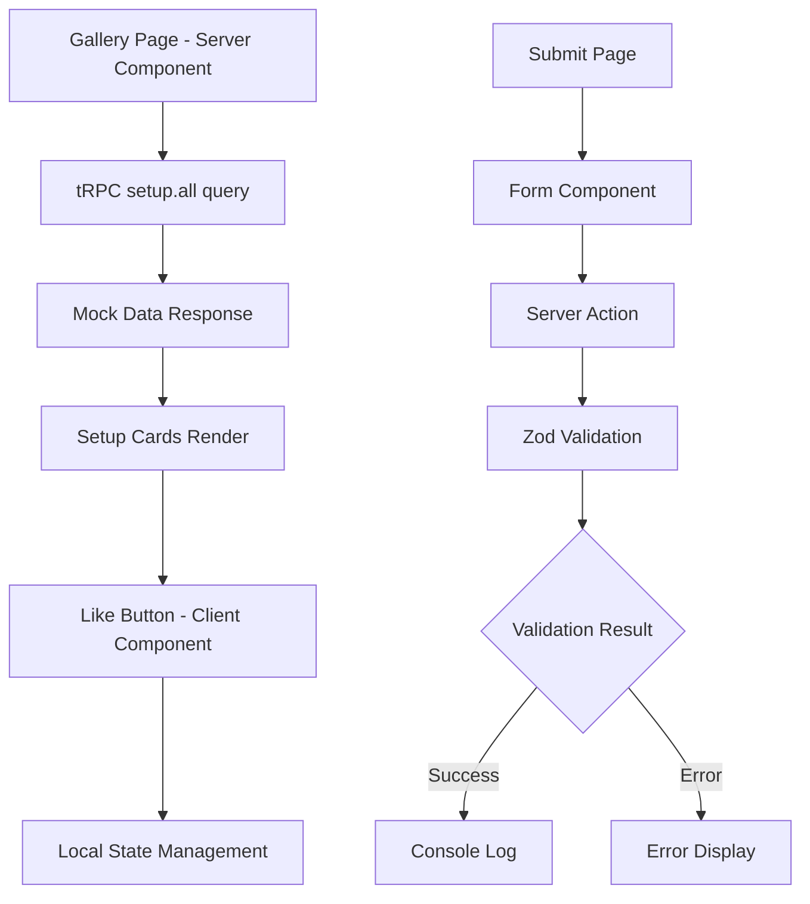

# Implementation Plan: "Rate My Setup" Gallery App

## Executive Summary

This document provides a comprehensive implementation plan for the "Rate My Setup" take-home assessment. The plan follows the established rule system and ensures adherence to Next.js 15, React 19, TypeScript, and tRPC best practices while delivering all required features within the 3-4 hour timeframe.

**Assessment Requirements:**

- Gallery page displaying setups with server-side tRPC data fetching
- Client-side like functionality with local state management
- Submission form with Next.js Server Actions and Zod validation
- Optional advanced challenges (optimistic UI, shared validation, component architecture)

**Current Status:** Phase 2.2 (Setup Card Component) ✅ **COMPLETED**. Gallery page fully implemented with server-side data fetching, responsive grid layout, optimized code structure, and complete SetupCard components with hybrid server/client architecture. Ready for Phase 2.3 (Like Button functionality).

---

## 1. Project Analysis & Current State

### ✅ Established Foundation

- **Rule System**: 10 comprehensive rule files covering all development aspects
- **Technology Stack**: Next.js 15, React 19, TypeScript, tRPC v11, Tailwind CSS
- **Mock Data**: Complete setup data with 12 entries in `packages/api/src/router/setup.ts`
- **Project Structure**: T3 Turbo monorepo with proper package organization
- **UI Components**: shadcn/ui components available in `@acme/ui` package

### 🔍 Current Implementation Status

- **tRPC Setup Router**: ✅ Complete with `all` and `byId` procedures
- **Phase 1 - Core Infrastructure**: ✅ **COMPLETED** - All tasks finished
- **Phase 2.1 - Gallery Server Component**: ✅ **COMPLETED** - Server-side data fetching, responsive grid, error handling
- **Phase 2.2 - Setup Card Component**: ✅ **COMPLETED** - Hybrid server/client architecture with optimized layout
- **Gallery Page**: ✅ **COMPLETED** - Full implementation with optimized code structure and SetupCard components
- **Submission Page**: ✅ Basic structure complete, ready for Phase 3 implementation
- **Navigation System**: ✅ Centralized navigation component integrated into layout
- **UI Components**: ✅ Card and Badge components added to @acme/ui package
- **Custom Hooks**: ✅ `getSetups()` function with error handling and type safety
- **Image Handling**: ✅ `ImageWithFallback` component for graceful error handling
- **Like Functionality**: ❌ Not implemented (Phase 2.3)
- **Form Validation**: ❌ Not implemented (Phase 3)

---

## 2. Implementation Strategy & Approach

### Phase 1: Core Infrastructure Setup ✅ **COMPLETED** (30 minutes)

**Objective**: Prepare the application foundation for feature implementation

#### Task 1.1: Update Gallery Page Structure ✅ **COMPLETED**

- ✅ Replace existing `page.tsx` with setup gallery implementation
- ✅ Import tRPC server-side calling pattern using `prefetch(trpc.setup.all.queryOptions())`
- ✅ Set up proper page layout and container structure
- ✅ Implement server-side data fetching foundation

#### Task 1.2: Create Submission Page Route ✅ **COMPLETED**

- ✅ Create `apps/nextjs/src/app/submit/page.tsx`
- ✅ Set up basic page structure and form layout
- ✅ Implement navigation between pages
- ✅ Create centralized navigation component

#### Task 1.3: Add Required UI Components ✅ **COMPLETED**

```bash
cd packages/ui && pnpm ui-add card    # ✅ COMPLETED
cd packages/ui && pnpm ui-add badge   # ✅ COMPLETED
```

- ✅ Add Card component for setup display
- ✅ Add Badge component for tags (data available in mock data)
- ✅ Verify existing components (Button, Input, Label, Form)
- ✅ Create reusable Navigation component integrated into root layout

**Phase 1 Summary - What Was Accomplished:**

- **Gallery Page Foundation**: Server-side tRPC setup with proper page structure
- **Submission Page Foundation**: Basic page structure ready for form implementation
- **Navigation System**: Centralized navigation component integrated into root layout
- **UI Component Library**: Added Card and Badge components for future use
- **Code Quality**: Clean, maintainable architecture following established patterns
- **TypeScript Compliance**: Full type safety with no linting errors
- **Next.js 15 Patterns**: Following modern App Router and Server Component patterns

### Phase 2: Gallery Implementation (45 minutes)

**Objective**: Implement the core gallery functionality with server-side data fetching

#### Task 2.1: Setup Gallery Server Component ✅ **COMPLETED**

- ✅ Implement tRPC server-side calling pattern: `appRouter.createCaller(ctx).setup.all()`
- ✅ Create responsive grid layout using Tailwind CSS (1 col mobile, 2-3 cols tablet, 4 cols desktop)
- ✅ Ensure proper TypeScript typing for setup data with `RouterOutputs` type
- ✅ Create custom `getSetups()` function for centralized data fetching logic
- ✅ Implement proper error handling with try-catch and user-friendly error messages
- ✅ Optimize code structure by extracting `GalleryLayout` component to eliminate duplication

#### Task 2.2: Create Setup Card Component ✅ **COMPLETED**

- ✅ Design attractive card layout with image, title, author, description, and tags
- ✅ Implement responsive design with proper flexbox layout for consistent card heights
- ✅ Add proper image optimization with Next.js Image component and error handling
- ✅ Include description text with proper spacing and text truncation
- ✅ Display tags using optimized styling with proper positioning at bottom of cards
- ✅ Implement hybrid Server/Client component architecture for optimal performance
- ✅ Create reusable `ImageWithFallback` component for graceful image error handling
- ✅ Note: Tags and description are not required for submission form, only display
- ✅ **Enhancement Note**: While out of scope for this task, implementing full-screen image viewing would significantly improve user experience since viewing setup images is the main purpose of the application

#### Task 2.3: Implement Like Button (Client Component)

- Create separate client component for like functionality
- Use React useState for local like count management
- Implement proper event handling and state updates
- Add visual feedback (heart icon, count animation)

**Technical Requirements:**

- Server Component for data fetching
- Client Component for interactive elements
- Type-safe tRPC integration
- Responsive grid layout (1 col mobile, 2-3 cols tablet, 4 cols desktop)

### Phase 3: Submission Form Implementation (60 minutes)

**Objective**: Build complete form submission with validation

#### Task 3.1: Create Zod Validation Schema

- Define shared validation schema in `packages/validators`
- **Required fields only**: title (string, required), author (string, required), imageUrl (URL, required)
- **Note**: No tags or description in submission form per README requirements
- Export schema for reuse between client and server

#### Task 3.2: Implement Server Action

- Create Server Action in `apps/nextjs/src/app/submit/actions.ts`
- Implement FormData validation using Zod schema
- Return proper error responses for validation failures
- Log successful submissions to console

#### Task 3.3: Build Submission Form Component

- Create form using shadcn/ui Form components
- Implement client-side validation (optional for better UX)
- Handle server action responses and error display
- Add proper loading states and form reset

**Technical Requirements:**

- Next.js Server Actions
- Zod validation on server-side
- Proper error handling and user feedback
- Form accessibility and usability

### Phase 4: Enhancement & Polish (30 minutes)

**Objective**: Improve user experience and implement advanced features

#### Task 4.1: UI/UX Improvements

- Add loading states and skeletons
- Implement proper error boundaries
- Enhance responsive design
- Add smooth transitions and animations

#### Task 4.2: Navigation & Layout

- Add navigation header with links between pages
- Implement consistent page layout
- Add proper page titles and metadata

#### Task 4.3: Advanced Challenge Selection

Choose one advanced challenge to implement:

- **Option A**: Optimistic UI with `useOptimistic` hook
- **Option B**: Shared validation schema between client/server
- **Option C**: Advanced component patterns (Compound Components)

### Phase 5: Documentation & Quality Assurance (15 minutes)

**Objective**: Ensure deliverable quality and documentation

#### Task 5.1: Update DESIGN_CHOICES.md

- Document implementation decisions and trade-offs
- Explain architecture choices and patterns used
- Add challenges faced and lessons learned
- Include future improvement suggestions

#### Task 5.2: Code Quality Review

- Run linting and fix any issues
- Ensure TypeScript compilation without errors
- Test all functionality manually
- Verify responsive design on different screen sizes

---

## 3. Technical Implementation Details

### Data Flow Architecture



### Component Architecture

#### Gallery Page Structure

```typescript
// apps/nextjs/src/app/page.tsx - Server Component
export default async function GalleryPage() {
  const setups = await trpc.setup.all.query();

  return (
    <div className="container mx-auto px-4 py-8">
      <h1>Rate My Setup Gallery</h1>
      <div className="grid grid-cols-1 md:grid-cols-2 lg:grid-cols-3 xl:grid-cols-4 gap-6">
        {setups.map((setup) => (
          <SetupCard key={setup.id} setup={setup} />
        ))}
      </div>
    </div>
  );
}
```

#### Setup Card Component

```typescript
// components/setup-card.tsx - Client Component for like functionality
'use client';

interface SetupCardProps {
  setup: {
    id: string;
    title: string;
    author: string;
    imageUrl: string;
    description: string;
    likes: number;
    tags: string[]; // Available in mock data, display only (not in submission form)
  };
}

export function SetupCard({ setup }: SetupCardProps) {
  const [likes, setLikes] = useState(setup.likes);
  const [isLiked, setIsLiked] = useState(false);

  const handleLike = () => {
    setLikes(prev => isLiked ? prev - 1 : prev + 1);
    setIsLiked(prev => !prev);
  };

  return (
    <Card className="overflow-hidden">
      <div className="aspect-video relative">
        <Image
          src={setup.imageUrl}
          alt={setup.title}
          fill
          className="object-cover"
        />
      </div>
      <CardContent className="p-4">
        <h3 className="font-semibold text-lg">{setup.title}</h3>
        <p className="text-muted-foreground">by {setup.author}</p>
        <p className="text-sm mt-2">{setup.description}</p>
        <div className="flex flex-wrap gap-1 mt-2">
          {setup.tags.map((tag) => (
            <Badge key={tag} variant="secondary" className="text-xs">
              {tag}
            </Badge>
          ))}
        </div>
        <Button
          onClick={handleLike}
          variant={isLiked ? "default" : "outline"}
          className="mt-4 w-full"
        >
          ❤️ {likes} likes
        </Button>
      </CardContent>
    </Card>
  );
}
```

### Validation Schema Design

```typescript
// packages/validators/src/setup.ts
import { z } from "zod";

export const submitSetupSchema = z.object({
  title: z.string().min(1, "Title is required").max(100, "Title too long"),
  author: z
    .string()
    .min(1, "Author is required")
    .max(50, "Author name too long"),
  imageUrl: z.string().url("Must be a valid URL"),
});

export type SubmitSetupInput = z.infer<typeof submitSetupSchema>;
```

### Server Action Implementation

```typescript
// apps/nextjs/src/app/submit/actions.ts
"use server";

import { submitSetupSchema } from "@acme/validators/setup";

export async function submitSetup(formData: FormData) {
  const result = submitSetupSchema.safeParse({
    title: formData.get("title"),
    author: formData.get("author"),
    imageUrl: formData.get("imageUrl"),
  });

  if (!result.success) {
    return {
      success: false,
      errors: result.error.flatten().fieldErrors,
    };
  }

  // Log successful submission
  console.log("New setup submitted:", result.data);

  return {
    success: true,
    data: result.data,
  };
}
```

---

## 4. Advanced Challenge Implementation Options

### Option A: Optimistic UI with useOptimistic

```typescript
"use client";

import { useOptimistic } from "react";

export function SetupCard({ setup }: SetupCardProps) {
  const [optimisticLikes, addOptimisticLike] = useOptimistic(
    setup.likes,
    (currentLikes, increment: number) => currentLikes + increment,
  );

  const handleLike = () => {
    const increment = isLiked ? -1 : 1;
    addOptimisticLike(increment);
    setIsLiked((prev) => !prev);
  };

  // ... rest of component
}
```

### Option B: Shared Validation Schema

```typescript
// Client-side validation with react-hook-form
import { zodResolver } from "@hookform/resolvers/zod";
import { useForm } from "react-hook-form";

import { submitSetupSchema } from "@acme/validators/setup";

export function SubmissionForm() {
  const form = useForm({
    resolver: zodResolver(submitSetupSchema),
    defaultValues: {
      title: "",
      author: "",
      imageUrl: "",
    },
  });

  // ... form implementation
}
```

### Option C: Compound Components Pattern

```typescript
// Flexible Setup Card with compound components
export const SetupCard = {
  Root: SetupCardRoot,
  Image: SetupCardImage,
  Content: SetupCardContent,
  Header: SetupCardHeader,
  Description: SetupCardDescription,
  Tags: SetupCardTags,
  LikeButton: SetupCardLikeButton,
};

// Usage
<SetupCard.Root>
  <SetupCard.Image src={setup.imageUrl} alt={setup.title} />
  <SetupCard.Content>
    <SetupCard.Header title={setup.title} author={setup.author} />
    <SetupCard.Description>{setup.description}</SetupCard.Description>
    <SetupCard.Tags tags={setup.tags} />
    <SetupCard.LikeButton initialLikes={setup.likes} />
  </SetupCard.Content>
</SetupCard.Root>
```

---

## 5. Quality Assurance & Testing Strategy

### Manual Testing Checklist

#### Gallery Page Testing

- [ ] Page loads without errors
- [ ] All 12 setups display correctly
- [ ] Images load and display properly
- [ ] Responsive layout works on mobile/tablet/desktop
- [ ] Like buttons increment/decrement correctly
- [ ] Like state persists during page interaction

#### Submission Page Testing

- [ ] Form displays all required fields
- [ ] Client-side validation works (if implemented)
- [ ] Server-side validation errors display correctly
- [ ] Successful submission shows confirmation
- [ ] Form resets after successful submission
- [ ] Navigation between pages works

#### Cross-Browser Testing

- [ ] Chrome (primary development browser)
- [ ] Safari (mobile testing)
- [ ] Firefox (alternative testing)

### Performance Considerations

#### Image Optimization

- Use Next.js Image component with proper sizing
- Implement lazy loading for gallery images
- Consider blur placeholders for better UX

#### Bundle Size Management

- Use dynamic imports for heavy components if needed
- Ensure tRPC client-side bundle is optimized
- Monitor bundle analyzer output

---

## 6. Risk Management & Contingency Plans

### Time Management Risks

#### Risk: Feature Implementation Takes Longer Than Expected

**Mitigation Strategy:**

- Prioritize core features (gallery + basic like functionality)
- Implement submission form as MVP without advanced validation
- Skip advanced challenges if time is short
- Focus on working functionality over polish

#### Risk: tRPC Integration Issues

**Contingency Plan:**

- Fall back to direct API routes if tRPC server-side calling is problematic
- Use client-side tRPC queries as alternative
- Implement static data rendering if necessary

#### Risk: Styling/Responsive Design Challenges

**Time-Saving Approach:**

- Use existing Tailwind utility classes
- Implement mobile-first, simple grid layout
- Focus on functionality over visual perfection

### Technical Risks

#### Risk: TypeScript Compilation Errors

**Prevention:**

- Maintain strict typing throughout development
- Regular compilation checks during implementation
- Use proper type imports for tRPC procedures

#### Risk: Server Action Implementation Issues

**Backup Plan:**

- Use traditional form submission with API routes
- Implement basic validation without Zod if necessary
- Focus on functional form over advanced error handling

---

## 7. Success Metrics & Completion Criteria

### Core Feature Completion

#### Gallery Page Requirements ✅

- [ ] Server Component implementation
- [ ] tRPC server-side data fetching
- [ ] Responsive grid layout
- [ ] All 12 setups displayed
- [ ] Proper TypeScript typing

#### Like Functionality Requirements ✅

- [ ] Client Component implementation
- [ ] Local state management
- [ ] Visual feedback for interactions
- [ ] Like count persistence during session

#### Submission Form Requirements ✅

- [ ] Next.js Server Action implementation
- [ ] Zod validation on server-side
- [ ] Error handling and display
- [ ] Form accessibility

### Quality Standards

#### Code Quality Metrics

- [ ] Zero TypeScript errors
- [ ] No ESLint warnings
- [ ] Proper component separation (Server/Client)
- [ ] Consistent code formatting

#### User Experience Standards

- [ ] Responsive design works across devices
- [ ] Loading states provide feedback
- [ ] Error messages are clear and helpful
- [ ] Navigation is intuitive

#### Documentation Standards

- [ ] DESIGN_CHOICES.md updated with implementation details
- [ ] Code includes appropriate comments
- [ ] README instructions remain accurate

---

## 8. Implementation Timeline

### Hour 1: Infrastructure & Setup (Tasks 1.1-2.1)

- **0:00-0:15**: Project setup and UI component installation
- **0:15-0:30**: Gallery page structure replacement
- **0:30-0:45**: Create submission page route
- **0:45-1:00**: Begin gallery server component implementation

### Hour 2: Gallery Implementation (Tasks 2.2-2.3)

- **1:00-1:30**: Complete setup card component design
- **1:30-2:00**: Implement like button functionality and client state

### Hour 3: Form Implementation (Tasks 3.1-3.3)

- **2:00-2:20**: Create Zod validation schema
- **2:20-2:40**: Implement Server Action
- **2:40-3:00**: Build submission form component

### Hour 4: Polish & Documentation (Tasks 4.1-5.2)

- **3:00-3:30**: UI/UX improvements and advanced challenge
- **3:30-3:45**: Documentation updates
- **3:45-4:00**: Final testing and quality review

---

## 9. Advanced Challenge Selection Strategy

Based on time remaining and implementation progress, choose the most impactful advanced challenge:

### Recommended Priority Order:

1. **Shared Validation Schema** (if form implementation goes smoothly)

   - Demonstrates understanding of code reuse
   - Improves user experience with client-side validation
   - Shows advanced TypeScript/Zod knowledge

2. **Optimistic UI with useOptimistic** (if React 19 features are desired)

   - Showcases modern React patterns
   - Improves perceived performance
   - Demonstrates advanced state management

3. **Compound Components** (if component architecture is focus)
   - Shows advanced component design patterns
   - Demonstrates flexibility and reusability
   - Good for showcasing architectural thinking

---

## 10. Post-Implementation Review & Next Steps

### Immediate Post-Completion Tasks

1. **Comprehensive Testing**: Manual testing of all features
2. **Documentation Update**: Complete DESIGN_CHOICES.md with actual implementation details
3. **Code Review**: Self-review for consistency and quality
4. **Git Cleanup**: Ensure clean commit history with conventional commits

### Future Enhancement Roadmap

#### Phase 1: Production Readiness

- Database integration for persistent data
- User authentication with better-auth
- Image upload functionality
- Rate limiting and security measures

#### Phase 2: Feature Expansion

- **AI-Powered Tag System**:
  - Use AI/ML to analyze uploaded images and suggest relevant tags
  - Allow users to select from existing tags or create new ones
  - Automatic tag generation based on image content (desk type, lighting, style, etc.)
  - Tag management and categorization system
- **Enhanced Submission Form**: Add optional description and tag selection
- **Search and Filtering**: Filter by title, author, tags, or description
- **Setup Detail Pages**: Individual pages for each setup with full details
- **Comment System**: User comments and discussions on setups
- **Real-time Like Updates**: Live synchronization across users

#### Phase 3: Performance & Scale

- Image optimization and CDN integration
- Caching strategies
- Infinite scroll pagination
- Analytics and monitoring

---

## Conclusion

This implementation plan provides a structured approach to delivering the "Rate My Setup" assessment requirements while maintaining code quality and following established patterns. The plan prioritizes core functionality while leaving room for advanced features and ensures proper documentation of decisions and trade-offs.

**Key Success Factors:**

- Adherence to the established rule system
- Focus on working functionality over perfect polish
- Proper separation of Server and Client Components
- Type-safe implementation throughout
- Clear documentation of decisions and trade-offs

The plan is designed to be executed within the 3-4 hour timeframe while delivering a production-quality foundation that demonstrates technical competency and engineering best practices.
